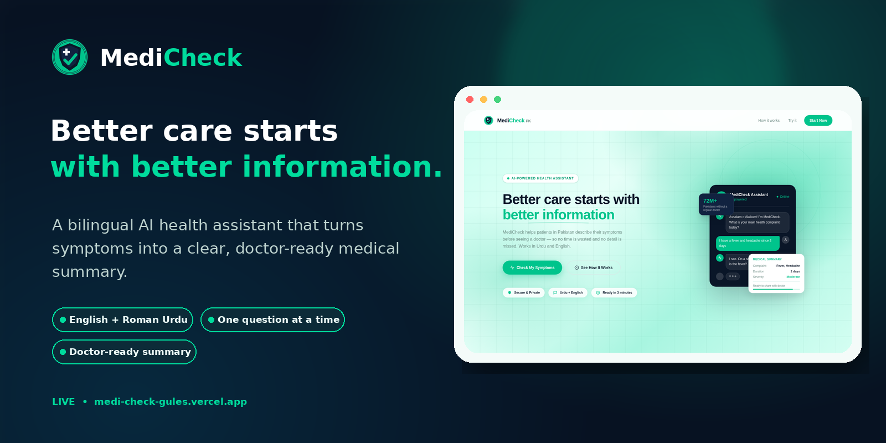
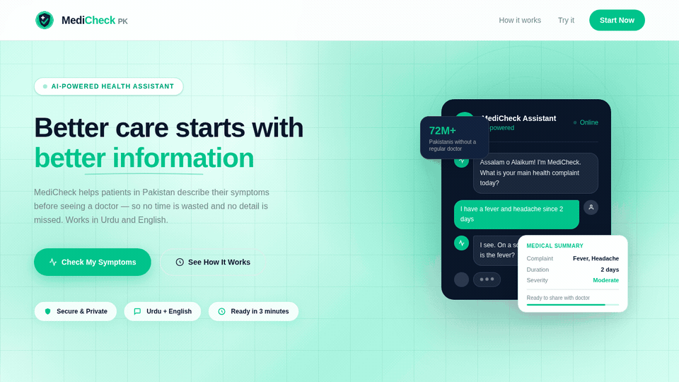
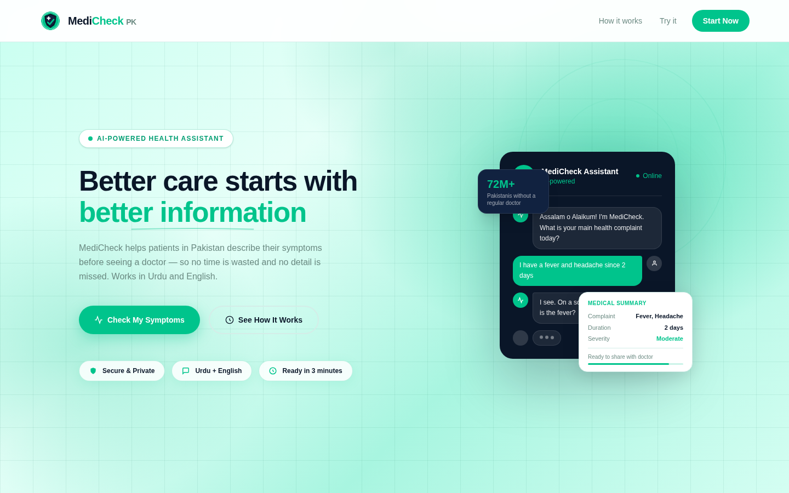
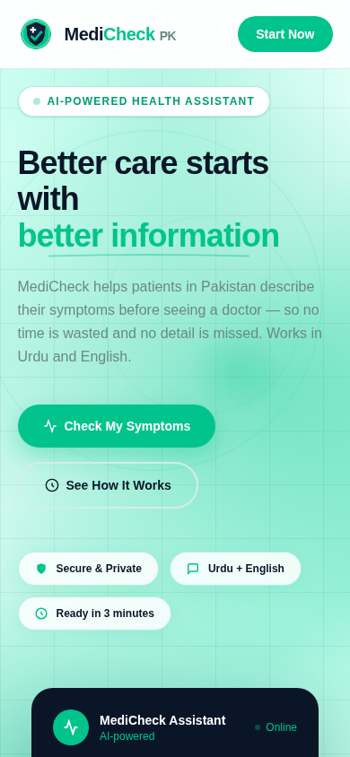
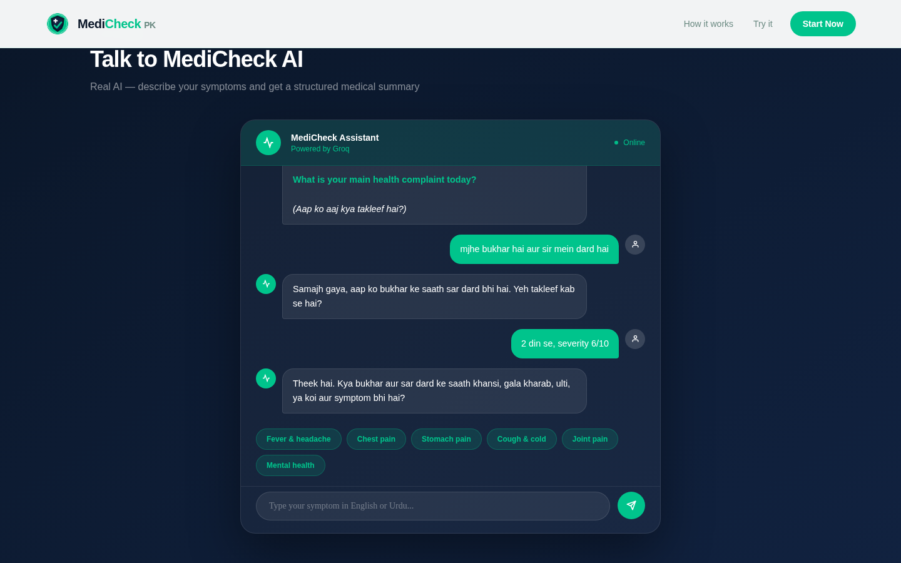
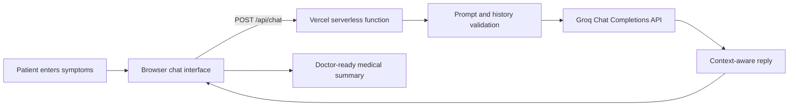

<p align="center">
  
</p>

<p align="center">
  <a href="https://medi-check-gules.vercel.app/"></a>
  <a href="LICENSE"></a>
  
  
</p>

<p align="center">
  <strong>A bilingual AI-assisted symptom intake experience built for Pakistani patients.</strong><br />
  English or Roman Urdu in. A clean, doctor-ready medical summary out.
</p>

---

## Overview

**MediCheck PK** helps patients describe their symptoms clearly before a medical appointment. Instead of presenting a long form, the assistant asks **one simple question at a time**, remembers the conversation, and organizes the answers into a structured medical summary that can be copied and shown to a healthcare professional.

The experience is designed around the way many patients in Pakistan naturally communicate: **English, Urdu, and Roman Urdu**. MediCheck is not a diagnostic system and does not prescribe treatment. Its role is to improve symptom communication, highlight urgent warning signs, and reduce missing information during a consultation.

<p align="center">
  <a href="https://medi-check-gules.vercel.app/"><strong>Open the live app →</strong></a>
</p>

## Product Demo

<p align="center">
  
</p>

## Product Preview

| Desktop experience | Mobile experience |
|---|---|
|  |  |

<p align="center">
  
</p>

## Core Features

- **Bilingual conversation** — supports English and Roman Urdu while matching the patient's language.
- **One question at a time** — keeps symptom intake simple and avoids overwhelming the patient.
- **Conversation memory** — continues from previous answers instead of restarting the interview.
- **Structured medical summary** — organizes complaint, duration, severity, symptoms, age, allergies, medicines, and red flags.
- **Urgent red-flag awareness** — surfaces emergency guidance for high-risk symptoms such as severe breathing difficulty, seizures, stroke-like weakness, or chest pain with warning signs.
- **Responsive product UI** — optimized for desktop and mobile browsers.
- **Server-side API protection** — the Groq key stays inside the Vercel serverless environment and is never exposed to the browser.
- **Model fallback handling** — retries supported models when a provider returns an unsupported tool-call or model error.
- **Copy-ready output** — generated summaries can be copied and shared during a clinic visit.

## How It Works



1. The patient describes the main complaint in English or Roman Urdu.
2. MediCheck asks focused follow-up questions about duration, severity, related symptoms, age, allergies, and medicines.
3. The backend sends the system instructions and full conversation history to Groq.
4. When enough information is available, the assistant offers a structured summary for the doctor.
5. Emergency warning signs interrupt the normal flow and trigger urgent-care guidance.

## Technology Stack

| Layer | Technology |
|---|---|
| Frontend | HTML5, CSS, Tailwind CSS, Vanilla JavaScript |
| AI API | Groq Chat Completions |
| Backend | Vercel Serverless Function (`api/chat.mjs`) |
| Deployment | Vercel |
| Interface | Responsive single-page web application |
| Default model configuration | `qwen/qwen3.6-27b` with `openai/gpt-oss-20b` fallback |

## Project Structure

```text
MediCheck/
├── api/
│   └── chat.mjs                 # Secure Groq serverless endpoint
├── docs/
│   └── assets/
│       ├── banner.png           # README product banner
│       ├── demo.gif             # Animated product demo
│       ├── home-preview.png     # Desktop preview
│       ├── chat-preview.png     # Chat preview
│       ├── mobile-preview.png   # Mobile preview
│       └── full-page-preview.png
├── public/
│   ├── assets/
│   │   └── Medi-Check-logo.png
│   └── index.html               # Complete frontend application
├── .env.example
├── .gitignore
├── CONTRIBUTING.md
├── LICENSE
├── package.json
├── package-lock.json
├── README.md
├── SECURITY.md
└── vercel.json
```

## Run Locally

### Prerequisites

- Node.js 18 or newer
- A Groq API key
- Vercel CLI

### 1. Clone the repository

```bash
git clone https://github.com/anamta-JINX/MediCheck.git
cd MediCheck
```

### 2. Install the Vercel CLI

```bash
npm install --global vercel
```

### 3. Configure environment variables

Create a `.env.local` file in the project root:

```env
GROQ_API_KEY=your_groq_api_key_here
```

An optional model override can also be supplied:

```env
GROQ_MODEL=qwen/qwen3.6-27b
```

Never place the real API key inside `public/index.html` or commit it to GitHub.

### 4. Start the development server

```bash
vercel dev
```

Open the local URL printed by Vercel, usually `http://localhost:3000`.

## Deploy to Vercel

1. Import the GitHub repository into Vercel.
2. Open **Project Settings → Environment Variables**.
3. Add `GROQ_API_KEY` for Production, Preview, and Development as needed.
4. Optionally add `GROQ_MODEL`.
5. Redeploy the project.

The frontend sends requests to the same-origin endpoint:

```text
POST /api/chat
```

The API key remains available only to `api/chat.mjs` on the server.

## API Request Format

```json
{
  "system": "System instructions for the symptom-intake assistant",
  "messages": [
    {
      "role": "assistant",
      "content": "What is your main health complaint today?"
    },
    {
      "role": "user",
      "content": "mjhe bukhar hai"
    }
  ],
  "max_tokens": 500
}
```

Successful response:

```json
{
  "text": "Samajh gaya, aap ko bukhar hai. Yeh bukhar kab se hai?"
}
```

## Safety and Responsible Use

> [!IMPORTANT]
> MediCheck is an information-collection assistant, **not a doctor, diagnostic device, or emergency service**. Its output should not replace professional medical advice, examination, diagnosis, or treatment.

The application is instructed to:

- avoid diagnosing conditions;
- avoid prescribing medicines;
- ask focused symptom-intake questions;
- advise urgent hospital or emergency attention when serious red flags are reported;
- recommend sharing the final summary with a qualified healthcare professional.

For production use, add appropriate privacy controls, consent, logging restrictions, clinical review, security testing, and compliance processes for the jurisdictions where the application operates.

## Roadmap

- [ ] Download summaries as PDF
- [ ] Optional Urdu-script interface
- [ ] Patient-controlled conversation reset and history export
- [ ] Clinic-facing summary dashboard
- [ ] Accessibility and screen-reader audit
- [ ] Automated API and conversation-flow tests
- [ ] Privacy-first encrypted patient sessions
- [ ] Human-reviewed multilingual safety evaluations

## Contributing

Contributions, bug reports, and product suggestions are welcome. Read [`CONTRIBUTING.md`](CONTRIBUTING.md) before opening a pull request.

Please keep changes focused, preserve the medical-safety boundaries, and never commit API keys or patient information.

## License

Distributed under the **MIT License**. See [`LICENSE`](LICENSE) for details.

## Author

Built by **Anamta Gohar**.

- GitHub: [@anamta-JINX](https://github.com/anamta-JINX)
- Project: [MediCheck](https://github.com/anamta-JINX/MediCheck)
- Live application: [medi-check-gules.vercel.app](https://medi-check-gules.vercel.app/)

---

<p align="center">
  <strong>Better care starts with better information.</strong><br />
  If MediCheck helps your workflow, consider starring the repository.
</p>
